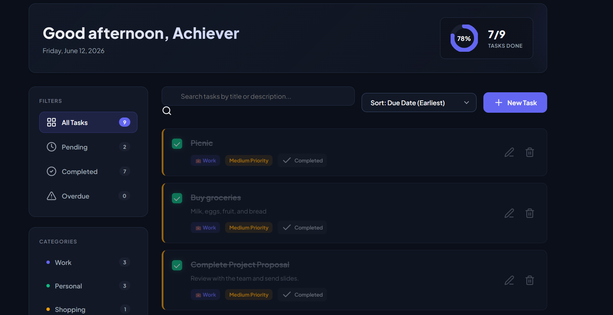

# SCT_WD_4
To-Do Web Application
# 📝 To-Do Web Application

A modern and responsive To-Do Web Application developed as **Task 4** of the **SkillCraft Technology Web Development Internship**.

## 🚀 Features

* Add new tasks
* Edit existing tasks
* Delete tasks
* Mark tasks as completed
* Set date and time for tasks
* Store tasks using Local Storage
* Responsive design for all devices
* Simple and user-friendly interface

## 🛠️ Technologies Used

* HTML5
* CSS3
* JavaScript (ES6)

## 📂 Project Structure

```text
SCT_WD_4/
│
├── index.html
├── style.css
├── script.js
└── README.md
```

 📸 Screenshots
 ##Home Screen



##Task Management


##Completed Tasks


🎯 Project Objectives

This application helps users manage their daily activities efficiently by providing features to create, update, organize, and track tasks.

💡 Key Concepts Implemented

* DOM Manipulation
* Event Handling
* Local Storage
* Responsive Web Design
* Interactive User Interface

🔮 Future Enhancements

* Dark Mode
* Task Categories
* Priority Levels
* Search Functionality
* Task Filtering
* Notifications and Reminders

📖 Learning Outcomes

Through this project, I gained practical experience in:

* Front-End Web Development
* JavaScript Programming
* User Interface Design
* Local Storage Management
* Responsive Layout Design

 🙏 Acknowledgement

This project was completed as part of the **SkillCraft Technology Web Development Internship Program**.

⭐ If you found this project useful, feel free to star the repository.
